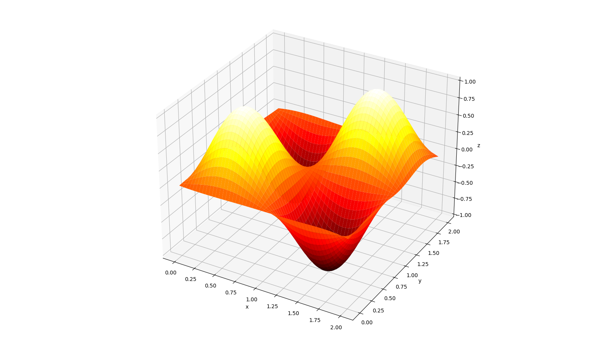

# Differential_equation_neural_network
### This PINN is used to solve the Poisson's equation with given boundary conditions
There are an famous example, which is implemented in the current neural network (it was accidentally deleted, sorry for that)

